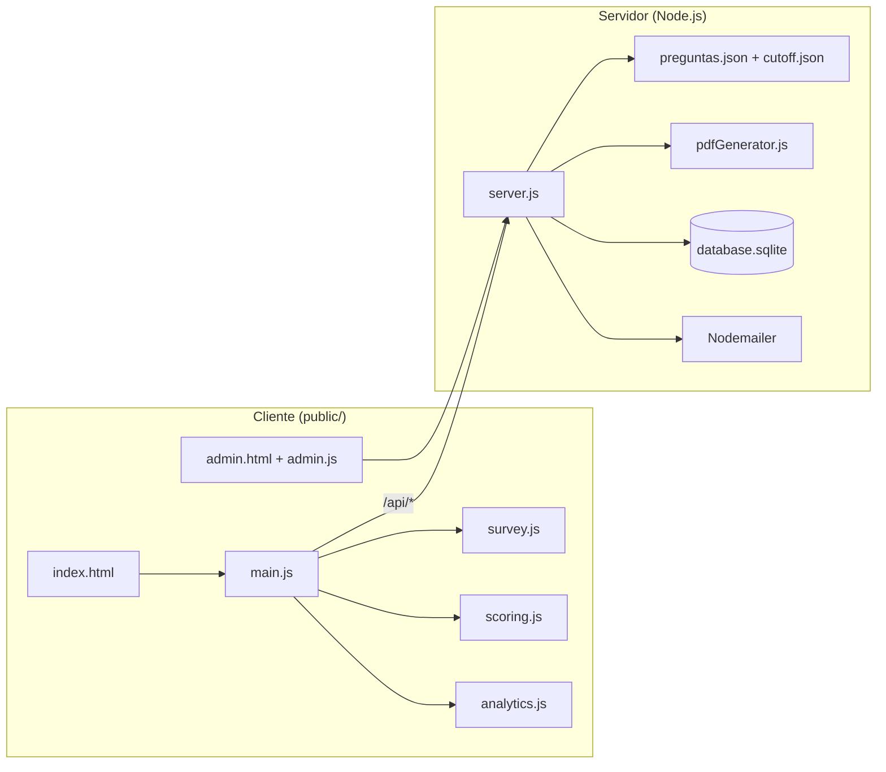

# 📊 Diagnóstico de Madurez Digital v1.2

Sistema de encuestas mobile-first para evaluación de madurez digital, con captura de leads, persistencia en SQLite y panel administrativo integrado.

## 🏗️ Arquitectura

Aplicación **monolítica Node.js**: Express sirve el frontend estático y la API REST. La configuración de la encuesta vive en JSON; el scoring se calcula en el cliente y se persiste en el servidor junto con los leads.



### Capas

| Capa | Tecnología | Responsabilidad |
|------|------------|-----------------|
| Frontend | HTML/CSS/JS vanilla en `public/` | UX mobile-first, motor de encuesta, captura de leads, panel admin |
| API | Express 4 + Helmet + CORS + rate-limit | Config, leads, analytics, rutas admin |
| Config | `preguntas.json`, `cutoff.json` | Preguntas, perfiles (rojo/amarillo/verde), rangos de puntaje (0–24) |
| Persistencia | SQLite3 (`database.sqlite`) | Tablas `leads` y `analytics` |
| Notificaciones | Nodemailer + PDFKit | Email con reporte PDF adjunto al completar lead con score |

### Flujo de usuario

1. **Intro** → inicio de encuesta (`survey_started` en analytics).
2. **8 preguntas** (0–3 puntos c/u, máx. 24) con barra de progreso (`survey.js`).
3. **Scoring** en cliente: suma de puntos + perfil según `cutoff.json` (`scoring.js`).
4. **Intersticial** (nombre + email) o “ver resultado sin informe”.
5. **Resultado** con CTA a calendario y formulario extendido (rubro, tamaño, cargo, WhatsApp, ubicación).
6. **Backend** `POST /api/leads`: deduplicación por email (update si existe, insert si no); con `scoreData` registra `lead_submitted` y envía email con PDF.

### API principal

| Método | Ruta | Descripción |
|--------|------|-------------|
| `GET` | `/api/config` | Preguntas, perfiles y reglas de scoring |
| `POST` | `/api/leads` | Crear/actualizar lead y opcionalmente guardar score + email |
| `POST` | `/api/analytics` | Eventos del funnel (`survey_started`, `question_answered`, `cta_clicked`, etc.) |
| `POST` | `/api/admin/login` | Validar contraseña admin |
| `GET` | `/api/admin/results` | Listado de leads con scores (requiere `x-admin-token`) |
| `GET` | `/api/admin/stats` | Totales y distribución de perfiles |
| `DELETE` | `/api/admin/leads/:id` | Eliminar lead y sus analytics |

### Estructura del proyecto

```
survey/
├── server.js           # API, SQLite, email, estáticos
├── preguntas.json      # Preguntas y copy de perfiles
├── cutoff.json         # Umbrales de scoring (0–11 / 12–18 / 19–24)
├── pdfGenerator.js     # Generación del reporte PDF
├── migrate.js          # Migración de columnas en SQLite
├── public/
│   ├── index.html      # Encuesta pública
│   ├── admin.html      # Panel administrativo
│   ├── css/
│   └── js/
│       ├── main.js     # Orquestación de pantallas y leads
│       ├── survey.js   # Motor de preguntas
│       ├── scoring.js  # Cálculo de puntaje y perfil
│       ├── analytics.js
│       ├── api.js
│       └── admin.js
└── database.sqlite     # Generado en runtime (no versionado)
```

## 🚀 Características Principales
- **Motor de Encuestas**: Lógica de scoring dinámica basada en JSON.
- **Captura de Leads**: Flujo intersticial y pre-resultado para maximizar conversión.
- **Deduplicación**: El sistema reconoce emails existentes y actualiza registros.
- **Panel Admin**: Visualización de estadísticas, detalle de respuestas de cada usuario y exportación a CSV.
- **Notificaciones**: Envío automático de reportes personalizados vía Email (Nodemailer).
- **Seguridad**: Protección de rutas administrativas y endurecimiento de headers (Helmet).

## 🛠️ Instalación

1. Clona el repositorio:
   ```bash
   git clone https://github.com/sector7gp/survey.git
   cd survey
   ```

2. Instala las dependencias:
   ```bash
   npm install
   ```

3. Configura el entorno:
   Crea un archivo `.env` en la raíz con:
   ```env
   PORT=3005
   ADMIN_PASSWORD=tu_clave_aqui
   
   # Configuración SMTP (Email)
   SMTP_HOST=smtp.ejemplo.com
   SMTP_PORT=465
   SMTP_USER=tu_usuario
   SMTP_PASS=tu_password
   FROM_EMAIL="Pablo Gon | Facilitador <correo@ejemplo.com>"
   ```

## 🗄️ Migraciones de Base de Datos
Si estás actualizando desde una versión anterior, debés correr el script de migración para agregar las nuevas columnas a la base de datos (`tamano_empresa`, `provincia`, `ciudad`, `whatsapp`, `cargo`):
```bash
node migrate.js
```

## 💻 Desarrollo

Para correr el proyecto localmente con recarga automática:
```bash
npm run dev
```
La aplicación estará disponible en `http://localhost:3005`.

## 🌐 Producción (con PM2)

Para garantizar que la aplicación se mantenga corriendo y se reinicie ante fallos:

1. Instala PM2 globalmente (si no lo tenés):
   ```bash
   npm install -g pm2
   ```

2. Inicia la aplicación:
   ```bash
   pm2 start server.js --name "digital-survey"
   ```

3. Comandos útiles de PM2:
   - `pm2 status`: Ver estado del proceso.
   - `pm2 logs digital-survey`: Ver logs en tiempo real.
   - `pm2 restart digital-survey`: Reiniciar la app.
   - `pm2 startup`: Configurar para que inicie al bootear el servidor.

## 🔑 Acceso Administrativo
El panel de control se encuentra en: `/admin.html`
Usa la clave definida en `ADMIN_PASSWORD`.

---
**Desarrollado por Antigravity para Pablo Gon | Facilitador Tecnologico**
