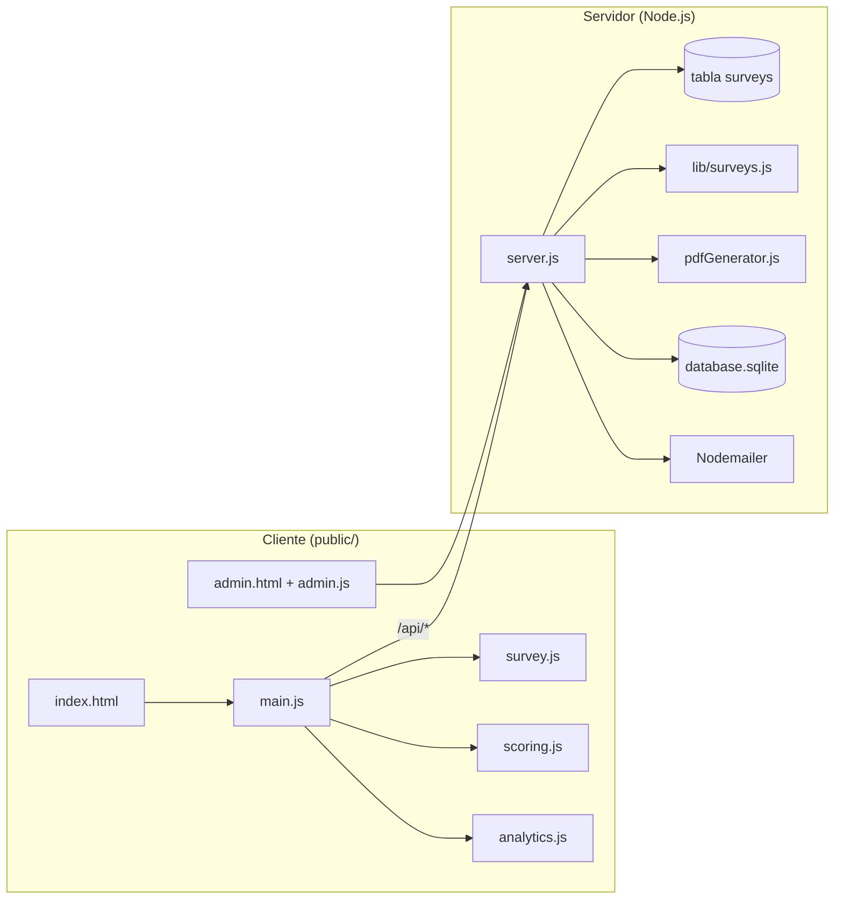

# 📊 Plataforma de Encuestas v2.0

Sistema multi-encuesta mobile-first: cada encuesta tiene un **ID público hasheado** (32 caracteres hex), configuración en base de datos, captura de leads por encuesta, panel administrativo con CRUD de encuestas y exportación CSV.

## 🏗️ Arquitectura

Aplicación **monolítica Node.js**: Express sirve el frontend estático y la API REST. Cada encuesta se almacena en SQLite (`surveys.config_json`); el scoring se calcula en el cliente y los leads se asocian por `survey_id`.



### Capas

| Capa | Tecnología | Responsabilidad |
|------|------------|-----------------|
| Frontend | HTML/CSS/JS vanilla en `public/` | UX mobile-first, motor de encuesta, captura de leads, panel admin |
| API | Express 4 + Helmet + CORS + rate-limit | Config, leads, analytics, rutas admin |
| Encuestas | Tabla `surveys` + `lib/surveys.js` | CRUD admin, `public_id` opaco, JSON con `meta`, `questions`, `profiles`, `scoring` |
| Persistencia | SQLite3 (`database.sqlite`) | Tablas `surveys`, `leads`, `analytics` |
| Notificaciones | Nodemailer + PDFKit | Email con reporte PDF adjunto al completar lead con score |

### Flujo de usuario

1. **Intro** → inicio de encuesta (`survey_started` en analytics).
2. **8 preguntas** (0–3 puntos c/u, máx. 24) con barra de progreso (`survey.js`).
3. **Scoring** en cliente: suma de puntos + perfil según `cutoff.json` (`scoring.js`).
4. **Intersticial** (nombre + email) o “ver resultado sin informe”.
5. **Resultado** con CTA a calendario y formulario extendido (rubro, tamaño, cargo, WhatsApp, ubicación).
6. **Backend** `POST /api/leads`: deduplicación por **email + encuesta**; con `scoreData` registra `lead_submitted` y envía email con PDF.

### Enlaces públicos por encuesta

| Formato | Ejemplo |
|---------|---------|
| Ruta corta | `https://tudominio.com/e/a1b2c3d4e5f6...` (32 chars) |
| Query param | `https://tudominio.com/?s=a1b2c3d4e5f6...` |
| Sin ID | Carga la encuesta marcada como **por defecto** |

El `public_id` se genera con `crypto.randomBytes(16)` (no es reversible desde el ID interno).

### API principal

| Método | Ruta | Descripción |
|--------|------|-------------|
| `GET` | `/api/surveys/:publicId/config` | Config de una encuesta por ID público |
| `GET` | `/api/config` | Encuesta por defecto (o `?s=publicId`) |
| `POST` | `/api/leads` | Lead + `survey_id` / `public_id` + score |
| `POST` | `/api/analytics` | Eventos con `survey_id` / `public_id` |
| `GET` | `/api/admin/surveys` | Listar encuestas (admin) |
| `GET` | `/api/admin/surveys/:id` | Detalle para edición (admin) |
| `POST` | `/api/admin/surveys` | Crear encuesta (admin) |
| `PUT` | `/api/admin/surveys/:id` | Modificar nombre, config JSON, activa/default (admin) |
| `DELETE` | `/api/admin/surveys/:id` | Eliminar o desactivar si tiene leads (admin) |
| `GET` | `/api/admin/results?survey_id=` | Leads filtrados por encuesta |
| `GET` | `/api/admin/stats?survey_id=` | Stats filtradas |

### Estructura del proyecto

```
survey/
├── server.js              # API, SQLite, email, estáticos
├── lib/surveys.js         # Validación, seed, helpers de encuestas
├── migrate-multi-survey.js # Migración a multi-encuesta
├── preguntas.json         # Legacy (seed de encuesta default)
├── cutoff.json            # Legacy (seed scoring default)
├── pdfGenerator.js        # Generación del reporte PDF
├── migrate.js             # Migración de columnas en leads
├── public/
│   ├── index.html      # Encuesta pública
│   ├── admin.html      # Panel administrativo
│   ├── css/
│   └── js/
│       ├── main.js     # Orquestación de pantallas y leads
│       ├── survey.js   # Motor de preguntas
│       ├── scoring.js  # Cálculo de puntaje y perfil
│       ├── analytics.js
│       ├── api.js
│       └── admin.js
└── database.sqlite     # Generado en runtime (no versionado)
```

## 🚀 Características Principales
- **Multi-encuesta**: Varias encuestas aisladas por `public_id` hasheado.
- **Admin CRUD**: Crear, editar (JSON), clonar, desactivar y copiar enlace público desde `/admin.html` → pestaña Encuestas.
- **Motor de Encuestas**: Scoring dinámico por JSON (`questions`, `profiles`, `scoring`).
- **Captura de Leads**: Flujo intersticial y formulario extendido por encuesta.
- **Deduplicación**: Mismo email en la **misma encuesta** actualiza el registro; en otra encuesta crea otro lead.
- **Panel Admin**: Stats y leads filtrables por encuesta, detalle de respuestas, CSV.
- **Notificaciones**: Envío automático de reportes personalizados vía Email (Nodemailer).
- **Seguridad**: Protección de rutas administrativas y endurecimiento de headers (Helmet).

## 🛠️ Instalación

1. Clona el repositorio:
   ```bash
   git clone https://github.com/sector7gp/survey.git
   cd survey
   ```

2. Instala las dependencias:
   ```bash
   npm install
   ```

3. Configura el entorno:
   Crea un archivo `.env` en la raíz con:
   ```env
   PORT=3005
   ADMIN_PASSWORD=tu_clave_aqui
   
   # Configuración SMTP (Email)
   SMTP_HOST=smtp.ejemplo.com
   SMTP_PORT=465
   SMTP_USER=tu_usuario
   SMTP_PASS=tu_password
   FROM_EMAIL="Pablo Gon | Facilitador <correo@ejemplo.com>"
   ```

## 🗄️ Migraciones de Base de Datos

**Multi-encuesta (v2):** importa `preguntas.json` + `cutoff.json` como encuesta por defecto si la BD está vacía:
```bash
node migrate-multi-survey.js
```

**Columnas de leads (v1):** si actualizás desde una versión muy antigua:
```bash
node migrate.js
```

## 💻 Desarrollo

Para correr el proyecto localmente con recarga automática:
```bash
npm run dev
```
La aplicación estará disponible en `http://localhost:3005`.

## 🌐 Producción (con PM2)

Para garantizar que la aplicación se mantenga corriendo y se reinicie ante fallos:

1. Instala PM2 globalmente (si no lo tenés):
   ```bash
   npm install -g pm2
   ```

2. Inicia la aplicación:
   ```bash
   pm2 start server.js --name "digital-survey"
   ```

3. Comandos útiles de PM2:
   - `pm2 status`: Ver estado del proceso.
   - `pm2 logs digital-survey`: Ver logs en tiempo real.
   - `pm2 restart digital-survey`: Reiniciar la app.
   - `pm2 startup`: Configurar para que inicie al bootear el servidor.

## 🔑 Acceso Administrativo
El panel de control se encuentra en: `/admin.html`
Usa la clave definida en `ADMIN_PASSWORD`.

---
**Desarrollado por Antigravity para Pablo Gon | Facilitador Tecnologico**
