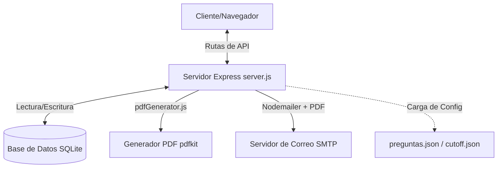
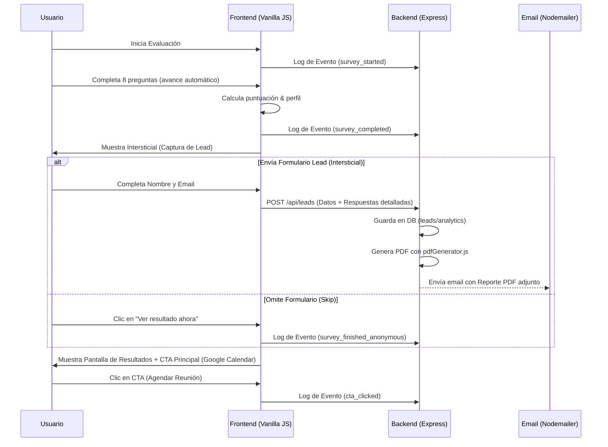

# 📊 Análisis del Proyecto: Diagnóstico de Madurez Digital v1.2.0

Este proyecto consiste en un **sistema de encuestas mobile-first** diseñado para evaluar el nivel de madurez digital de una empresa/pyme. Captura leads, persiste la información en una base de datos local SQLite, genera un reporte PDF dinámico y estéticamente premium, envía reportes automatizados mediante correo electrónico (SMTP/Nodemailer) con el PDF adjunto, y provee un panel de administración integrado para gestionar las métricas y los usuarios.

---

## 🛠️ Arquitectura General

El proyecto se estructura bajo un enfoque de desarrollo tradicional web ligero (Stack Vanilla JS / CSS y Node.js/Express) con modularidad y desacoplamiento de responsabilidades.

---

## 💾 Persistencia y Base de Datos (SQLite)

El backend utiliza SQLite (`database.sqlite`) para persistir la información recolectada. La base de datos contiene dos tablas principales:

### 1. Tabla `leads`
Guarda la información de contacto de las empresas evaluadas. Admite deduplicación mediante búsquedas y actualizaciones sobre el campo `email`.
* **Campos**:
  * `id` (INTEGER PRIMARY KEY AUTOINCREMENT)
  * `nombre` (TEXT)
  * `email` (TEXT)
  * `rubro` (TEXT)
  * `empresa` (TEXT)
  * `tamano_empresa` (TEXT) - Rango de empleados (1-50, 51-99, 100-300, 300+)
  * `provincia` (TEXT)
  * `ciudad` (TEXT)
  * `whatsapp` (TEXT)
  * `cargo` (TEXT)
  * `fecha` (DATETIME DEFAULT CURRENT_TIMESTAMP)

### 2. Tabla `analytics`
Loguea eventos clave del embudo de conversión para propósitos estadísticos y de auditoría.
* **Campos**:
  * `id` (INTEGER PRIMARY KEY AUTOINCREMENT)
  * `event_type` (TEXT) - ej. `survey_started`, `survey_completed`, `cta_clicked`, `lead_submitted`
  * `lead_id` (INTEGER) - Relación opcional con la tabla `leads`
  * `data` (TEXT) - Representación serializada (JSON) de los datos del evento
  * `fecha` (DATETIME DEFAULT CURRENT_TIMESTAMP)

---

## ⚙️ Configuración Dinámica (JSONs)

El motor de la encuesta es 100% configurable sin necesidad de modificar el código fuente del backend o frontend:

1. **`preguntas.json`**:
   * Contiene el array de `questions`, cada una con sus opciones (`options`) y el puntaje asignado a cada respuesta (`points` de 0 a 3).
   * Contiene el diccionario de perfiles (`profiles`: `green`, `yellow`, `red`), especificando su emoji, título, clase de CSS, descripción, título de CTA, texto de sugerencia y enlace externo (calendario).
2. **`cutoff.json`**:
   * Define los rangos de puntaje mínimo y máximo, y mapea los intervalos a cada perfil.
     * **0 a 11**: Perfil `red` (Gestión Reactiva)
     * **12 a 18**: Perfil `yellow` (Gestión en Transición)
     * **19 a 24**: Perfil `green` (Gestión Inteligente)

---

## 🚀 Flujo del Usuario y Conversión

El flujo está altamente optimizado para el embudo de ventas y la experiencia de usuario (UX):

---

## 📄 Generación de Reportes PDF (`pdfGenerator.js`)

Se ha incorporado el motor de reportes basado en `pdfkit` para componer un documento PDF estéticamente impecable que contiene:
* **Paleta de Colores Dinámica**: El encabezado y los bordes del reporte adoptan los colores del perfil del usuario (Verde, Amarillo o Rojo) para garantizar coherencia visual.
* **Sección de Datos del Lead**: Muestra de forma limpia los campos del formulario detallado (Empresa, Tamaño, WhatsApp, Ubicación, Cargo e Industria).
* **Bloque de Score & Perfil**: Un recuadro destacado con el puntaje total obtenido (sobre 24) y la descripción del perfil correspondiente.
* **Plan de Acción / Próximos Pasos**: Muestra los textos de sugerencias configurados en el JSON.
* **Detalle de Respuestas**: Incluye en páginas subsecuentes el listado de las 8 preguntas junto con las respuestas literales del usuario y su puntaje individual.

---

## 🔒 Panel de Administración y Seguridad

El sistema incluye una interfaz de control en `/admin.html` protegida mediante autenticación básica por contraseña (`ADMIN_PASSWORD`).

* **Seguridad**:
  * Implementación de **Helmet** para proteger headers HTTP.
  * **Rate Limiting** para mitigar ataques de fuerza bruta en los endpoints `/api/*` (límite de 100 peticiones cada 15 minutos por IP).
  * Validación de tokens en cabeceras HTTP (`x-admin-token`).
* **Funcionalidades del Administrador**:
  * Visualización de métricas generales (Total de leads, Encuestas iniciadas y distribución de perfiles).
  * Tabla interactiva de leads en tiempo real con fecha, datos de contacto, tamaño, cargo, WhatsApp, ubicación, perfil obtenido, puntuación y registro de si hicieron clic en el CTA del calendario.
  * Botón para **exportar a CSV** de forma limpia (con soporte para acentos en Excel y envoltura de textos).
  * Modal detallado para ver la respuesta exacta que dio un lead a cada una de las 8 preguntas, además de todos sus datos demográficos y de contacto.
  * Acción para eliminar físicamente un lead y sus analíticas asociadas.

---

## 🎨 Diseño Visual y UX

* **Estética**: Basada en un diseño "glassmorphism" con un contenedor estilizado de bordes redondeados y fondos degradados dinámicos que cambian según el perfil obtenido por el usuario (`red`, `yellow` o `green`).
* **Tipografía**: Fuente premium *Inter* importada de Google Fonts.
* **Componentización**: En el cliente, el código se divide modularmente en:
  * `api.js`: Abstracción de llamadas HTTP con fallback de desarrollo local si el backend no está activo.
  * `analytics.js`: Centralizador del registro de métricas.
  * `scoring.js`: Procesador de puntuaciones basado en el JSON de corte.
  * `survey.js`: Manejador dinámico del ciclo de renderizado de la encuesta (barra de progreso, transiciones visuales, y control de botones Anterior/Siguiente).
  * `main.js`: Controlador principal y orquestador de transiciones de vistas.
